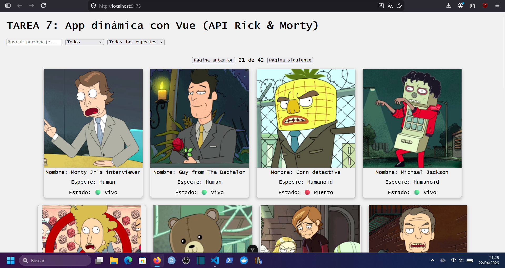
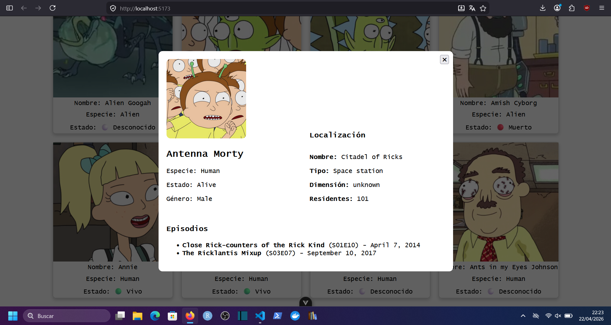
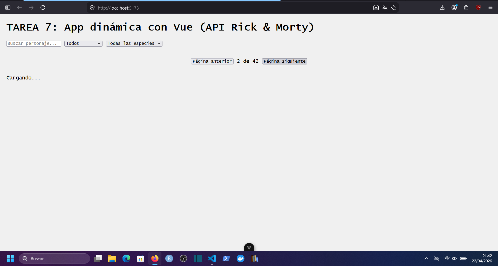
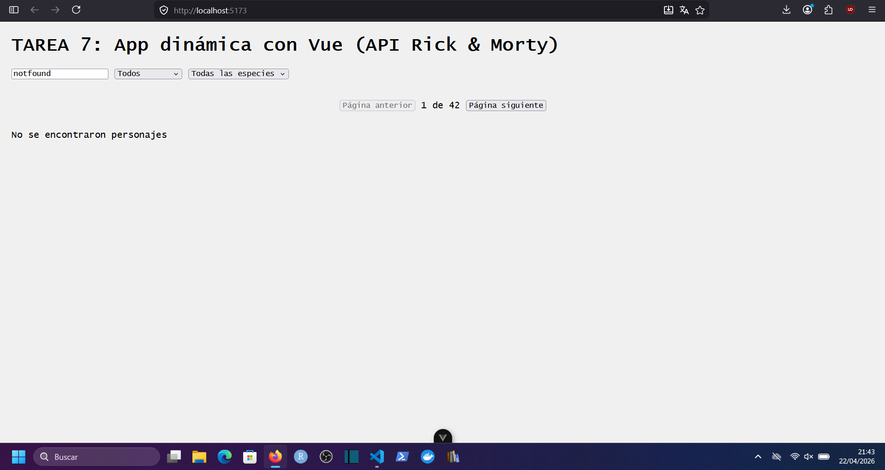
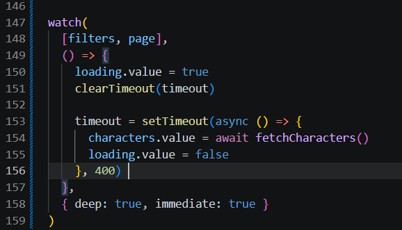
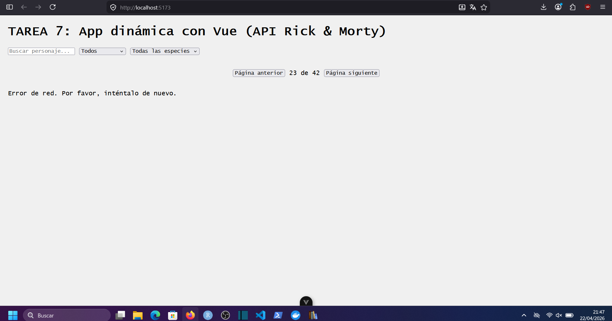

# TAREA 7: App dinámica con Vue/Nuxt (API Rick & Morty)

## Objetivo

Desarrollar una aplicación web dinámica utilizando Vue 3 o Nuxt que consuma datos de forma asíncrona desde una API pública y actualice la interfaz sin recargar la página.

Puedes ver el listado de requerimientos de esta tarea en [Requirements.md](./Requirements.md)



La aplicación permite ver un listado paginado de personajes y utilizar filtros para hacer búsquedas avanzadas.



Al hacer clic sobre un personaje, se abre un modal que recupera información adicional, como detalles sobre la localización o sobre los episodios en los que ha salido.


## Guía de uso

Para poder utilizar la aplicación puedes seguir los siguientes pasos:

```
git clone git@github.com:kasimxo/DWEC-UT07-VueDynamicApp.git
cd DWEC-UT07-VueDynamicApp
cd dwec-ut07-vuedynamicapp
npm install
npm run dev
```

Ahora podrás acceder a través del navegador en la dirección [http://localhost:5173](http://localhost:5173)

## Estructura

Siguiendo las indicaciones, el proyecto tiene un directorio de componentes, así como un directorio de assets en el que se incluye el archivo main.css, con algunas propiedades globales.

## Características

La aplicación es compatible con los principales navegadores, no emplea recargas si no que aprovecha el refresco de Vue a través distintos componentes para actualizar la interfaz.

## Componentes

Puedes ver todos los archivos de componentes en [components](./dwec-ut07-vuedynamicapp/src/components/)

- CharacterCard: Tarjeta para cada personaje. Muestra una imagen del personaje, así como el nombre y algunas de sus propiedades.
- CharacterDetail: Modal del detalle del personaje. Se muestra sobre el resto de la pantalla y se puede cerrar pulsando la x, la tecla ESC o haciendo clic fuera del modal.
- CharacterList: Listado de personajes que coinciden con los criterios de búsqueda. Solo muestra los personajes de la página actual (20 personajes por página).
- Filters: Componente que agrupa todos los subcomponentes de filtros, como la SearchBar, SpeciesFilter y StatusFilter.
- Pagination: Componente de paginación. Muestra la página actual y el total de páginas, además de tener un botón para avanzar y retroceder.
- SearchBar: Barra de búsqueda por nombre de personaje.
- SpeciesFilter: Lista desplegable de especies. Cuando seleccionas una especie, se filtran los resultados.
- StatusFilter: Lista desplegable de estados (vivo, muerto, desconocido). Cuando seleccionas un estado, se filtran los resultados.

## Gestión de errores

Durante el desarrollo y el testeo de la aplicación se han detectado algunos errores con la api de rickandmorty y se han implementado mecanismos de gestión.

Por un lado, la aplicación tiene un estado cargando mientras espera a la respuesta de la api.



Si la respuesta tiene el estado 404, se muestra el mensaje de error apropiado al usuario.



Si se hacen demasiadas llamadas en poco tiempo, la api responde con el código 429 (too many requests). Para evitar esto se han incluido mecanismos de [debounce](https://medium.com/@kushal.bhargava01/debounce-optimizing-api-call-in-js-dc166b8a55ee)



Además, se muestra un mensaje adecuado al usuario.

